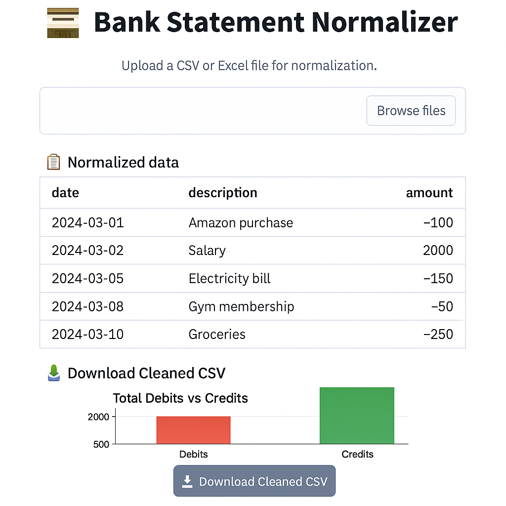

# 🏦 Bank Statement Normalizer

[](https://streamlit.io/)
[](https://www.python.org/)
[](./LICENSE)
[](https://pandas.pydata.org/)
[](https://scikit-learn.org/stable/)
[](https://github.com/Tshepo206/BankStatementNormalizer/stargazers)

Normalize messy bank statements → Clean, structured CSVs + insights.  
Built with **Python, Pandas, Scikit-learn, and Streamlit** to showcase practical data engineering.

---

## 📸 Screenshot



---

## 🚀 Quick Start

Follow these steps to set up and run the project locally:

```bash
# 1. Clone the repository
git clone https://github.com/Tshepo206/BankStatementNormalizer.git
cd BankStatementNormalizer

# 2. Create and activate a virtual environment
python -m venv .venv
source .venv/bin/activate    # On Mac/Linux
# OR
.venv\Scripts\activate       # On Windows

# 3. Install dependencies
pip install -r requirements.txt

# 4. Run the Streamlit app
streamlit run streamlit_app.py --server.port 8502
